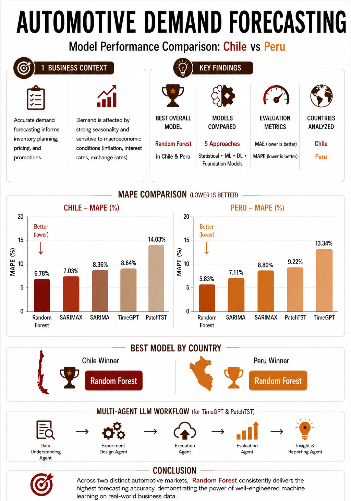

# Data Science Portfolio

A collection of end-to-end data science projects demonstrating machine learning, time-series forecasting, NLP, and sentiment analysis applied to real-world business problems.
---

## Project#1 

## Tech Stack
### Data Science & Machine Learning
- Python, Pandas, NumPy, Scikit-learn, TensorFlow / Keras, XGBoost

### Time-Series Forecasting
- SARIMAX, Random Forest, TimeGPT, PatchTST

📓 **Interactive Notebook (NBViewer)**
https://nbviewer.org/github/Nela-Git/automotive-demand-forecasting/blob/notebooks/Automotive_Demand_Forecasting_Git.ipynb

