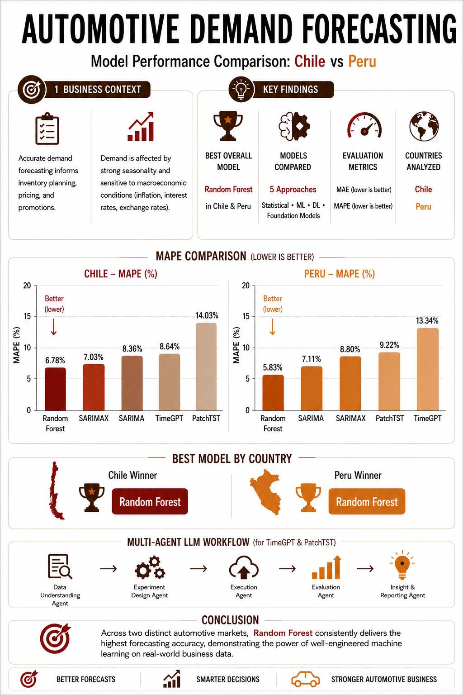

# Data Science Portfolio

A collection of end-to-end data science projects demonstrating machine learning, time-series forecasting, NLP, and sentiment analysis applied to real-world business problems.
---

## Project#1 

### 🚗 Automotive Demand Forecasting
Forecasting vehicle sales in Chile and Peru using classical, machine learning, and foundation models.

**Highlights**
- Forecasting vehicle sales in Chile and Peru
- SARIMAX, Random Forest, PatchTST, and TimeGPT
- Model comparison, backtesting, and residual diagnostics

## Results
- Random Forest achieved the strongest overall forecasting accuracy.
- TimeGPT performed particularly well in Chile.
- News sentiment improved SARIMAX residual diagnostics and interpretability.

## Tech Stack
### Data Science & Machine Learning
- Python
- Pandas
- NumPy
- Scikit-learn
- TensorFlow / Keras
- XGBoost

### Time-Series Forecasting
- SARIMAX
- TimeGPT
- PatchTST

